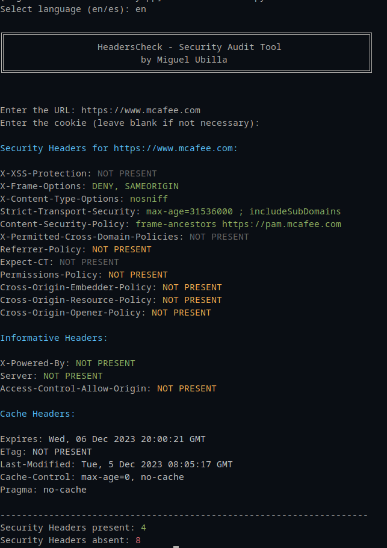

# **HeadersCheck**

## **Description**

HeadersCheck is a security audit tool designed to analyze and report on the security HTTP headers of a website. Written in Python, this tool classifies and displays security, informational, and cache headers, indicating their presence and level of importance. It now features multilingual support, allowing users to select between English and Spanish for the user interface.

## **Features**

- **Multilingual Support**: Choose between English and Spanish for the user interface.
- **Security Headers Analysis**: Evaluates common headers like X-XSS-Protection, Strict-Transport-Security, among others.
- **Severity Classification**: Headers are color-coded according to their level of importance: high, medium, or deprecated.
- **Support for Informational and Cache Headers**: Analyzes headers like Server, Cache-Control, etc.
- **Colorful Output**: Uses Colorama for an easy-to-read and visually differentiated output.
- **External JSON Data**: Language data stored in external JSON files for easy management and updates.

### **Requirements**

- Python 3
- Libraries: requests, colorama
- JSON files for multilingual support (`languages.json`)

### **Installation**

- Clone the repository or download the files.
- Install the dependencies:

  ```bash
  pip install requests colorama
  ```

### **Usage**

- Run the script:

  ```bash
  python headerscheck.py
  ```

- Select the language (English or Spanish).
- Enter the website URL to analyze.
- Optional: Enter a cookie if necessary. Cookie format: cookie_name=cookie_value

The script will display a detailed report of the present and absent headers, along with their level of severity, in the selected language.



### **Contributions**

Contributions are welcome. Please, send your pull requests or open issues to discuss possible improvements.

### **License**

This project is licensed under the MIT license..

### **Author**

Miguel Ubilla Rocco
